# Paper 1: LLM Safety — A Holistic Survey

**Authors:** Shi et al. (2024)  
**ArXiv:** 2412.17686  
**Pages:** 158  

---

## Abstract & Scope

This survey provides a comprehensive, multi-dimensional review of LLM safety covering **value misalignment, robustness, misuse, autonomous AI risks, agent safety, interpretability, and industry safety practices.** It catalogues risks from the training pipeline to deployment, and examines how interpretability tools can be leveraged to enhance safety.

---

## 1. Introduction & Taxonomy

The paper's overarching taxonomy organizes LLM safety into **8 major pillars:**

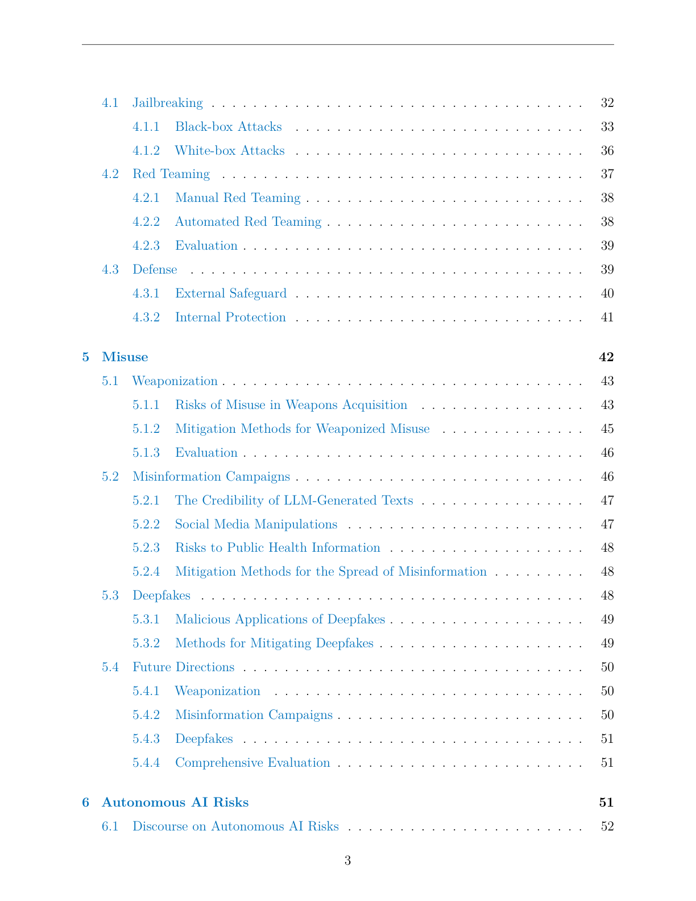

| # | Pillar | Description |
|---|--------|-------------|
| 1 | Value Misalignment (§3) | Bias, toxicity, ethics violations, hallucinations |
| 2 | Robustness (§4) | Adversarial attacks, OOD robustness, prompt injection, jailbreaks |
| 3 | Catastrophic Misuse (§5) | Weaponization, misinformation campaigns, deepfakes |
| 4 | Autonomous AI Risks (§6) | Power-seeking, goal drift, deception, situational awareness |
| 5 | Agent Safety (§7) | Language agents, embodied agents, multi-agent risks |
| 6 | Interpretability for Safety (§8) | SAEs, circuit analysis, alignment via interpretability |
| 7 | Technology Roadmaps (§9) | Industry practices at 18 companies and 11 institutes |
| 8 | Data Safety & Governance (§10) | Privacy, copyright, data poisoning, regulations |

---

## 2. Background (§2)

### 2.1 Architecture Evolution
- **Transformer architecture** (Vaswani et al., 2017) forms the backbone
- Key developments: GPT series, BERT, T5, LLaMA, Claude, Gemini
- Scaling laws: performance improves predictably with model size, data, and compute

### 2.2 Training Pipeline
1. **Pre-training:** Self-supervised on massive corpora (web text, books, code)
2. **Supervised Fine-Tuning (SFT):** Task-specific instruction tuning
3. **RLHF / DPO:** Alignment with human preferences via reward models

### 2.3 Capabilities
- In-context learning, chain-of-thought reasoning, code generation, tool use, multi-modal understanding

---

## 3. Value Misalignment (§3)

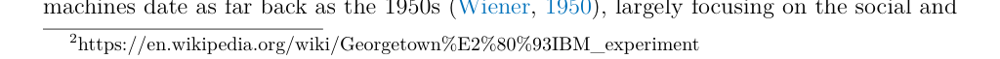

### 3.1 Bias & Discrimination
- **Sources:** Training data reflects societal biases → models amplify them
- **Types:** Gender, racial, religious, political, age-based biases
- **Measurement:** Intrinsic metrics (embedding associations), extrinsic metrics (downstream task performance)
- **Key works:** WinoBias, BBQ, StereoSet, CrowS-Pairs

### 3.2 Toxicity
- Models trained on internet text absorb toxic patterns
- **RealToxicityPrompts** benchmark: even benign prompts can trigger toxic completions
- Toxicity generation increases with model size and with certain prompting strategies

### 3.3 Ethical Violations
- Models may produce content that violates ethical norms around self-harm, violence, illegal activities
- **Challenge:** Defining universal ethics across cultures

### 3.4 Hallucinations
- **Factuality hallucinations:** Contradicting established facts
- **Faithfulness hallucinations:** Deviating from provided context/instructions
- **Causes:** Training data gaps, distributional mismatch, decoding artifacts
- **Mitigations:** RAG, self-consistency, fact-verification chains

### 3.5 Alignment Methods
- **RLHF** (Ouyang et al., 2022): Train reward model from human preferences, optimize via PPO
- **Constitutional AI** (Anthropic): Self-critique against a set of principles
- **DPO** (Rafailov et al., 2023): Simplified alignment bypassing reward model training
- **RLAIF:** AI-generated feedback as a cheaper alternative to human annotation
- **Key challenge:** Reward hacking, reward misgeneralization

### 3.6 Evaluation Benchmarks
| Benchmark | Focus |
|-----------|-------|
| TruthfulQA | Factual accuracy / hallucination |
| BBQ | Social bias in question answering |
| BOLD | Open-ended bias detection |
| ToxiGen | Machine-generated toxic text detection |
| HaluEval | Hallucination evaluation |

---

## 4. Robustness (§4)

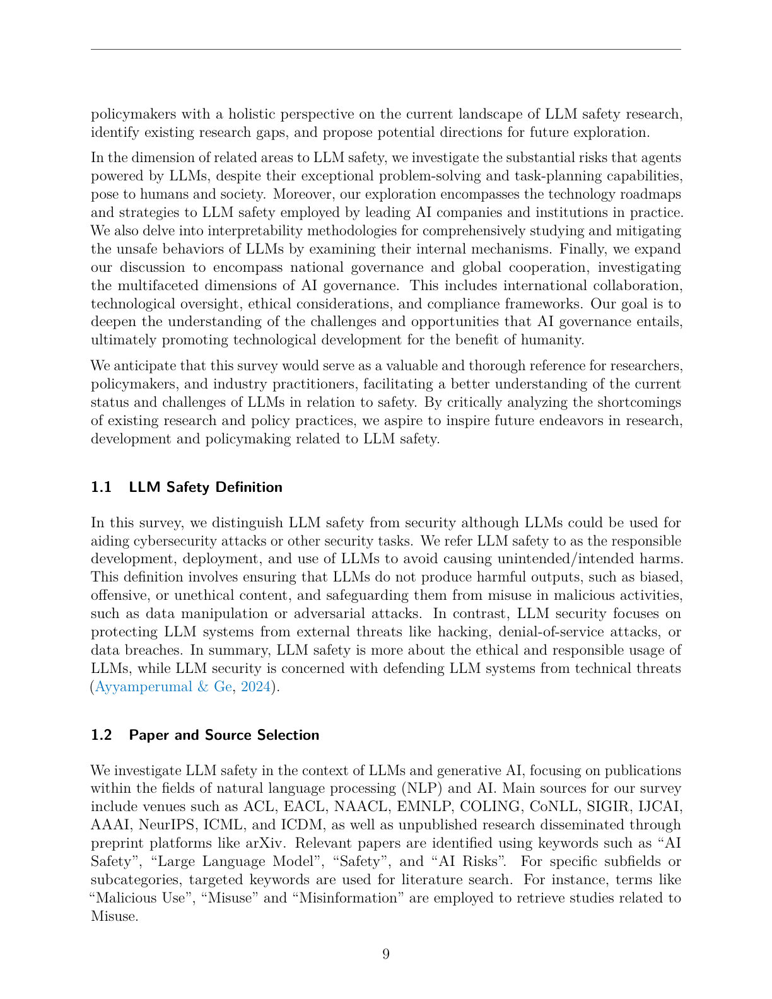

### 4.1 Adversarial Attacks on LLMs
- **Prompt-based attacks:** Carefully crafted inputs to bypass safety filters
- **Gradient-based attacks (white-box):** GCG (Zou et al., 2023) — finds universal adversarial suffixes via greedy coordinate gradient
- **Transfer attacks:** Adversarial prompts generated on open-source models transfer to closed-source APIs

### 4.2 Jailbreak Attacks

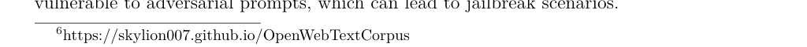

Comprehensive taxonomy:

| Category | Examples |
|----------|----------|
| **Hand-crafted** | DAN prompts, role-playing, language translation exploits |
| **Automated** | GCG, AutoDAN, PAIR, GPTFuzzer |
| **Fine-tuning based** | Removing safety alignment by fine-tuning on harmful data |
| **Multi-modal** | Exploiting image/audio channels to bypass text safety filters |

### 4.3 Prompt Injection

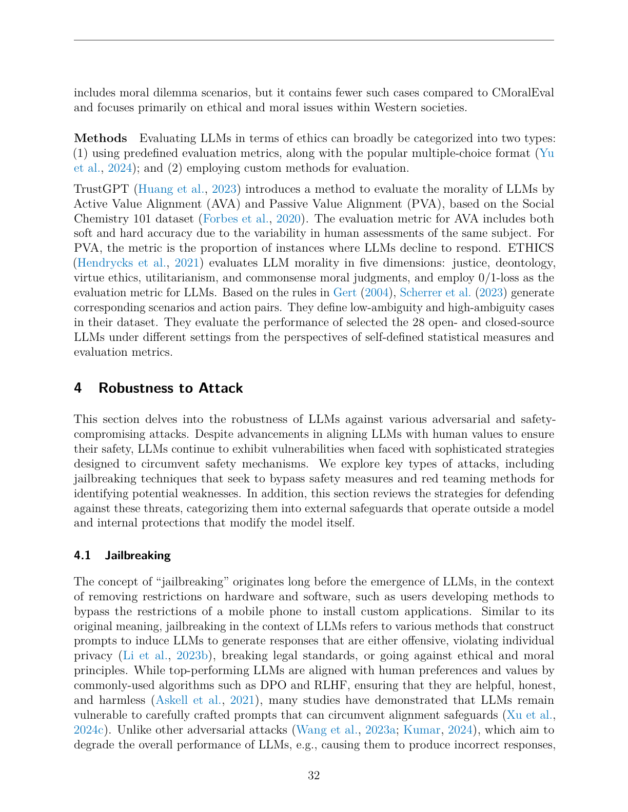

- **Direct injection:** User instructions that override system prompts
- **Indirect injection:** Malicious instructions embedded in retrieved documents/web content
- **Defenses:** Instruction hierarchy, input sanitization, delimiter-based separation

### 4.4 Jailbreak Defenses
- **Input-level:** SmoothLLM (random character perturbation), perplexity filtering, paraphrasing
- **Output-level:** Safety classifiers on generated text, self-examination
- **Ensemble:** Multiple defense layers combined
- **Fine-tuning defenses:** Vaccine, SafetyLock — preserving safety alignment during fine-tuning

### 4.5 Out-of-Distribution Robustness
- Models degrade on inputs outside training distribution
- Performance drops on domain-shifted tasks, novel linguistic patterns
- **Challenge:** Maintaining safety guarantees under distribution shift

---

## 5. Catastrophic Misuse (§5)

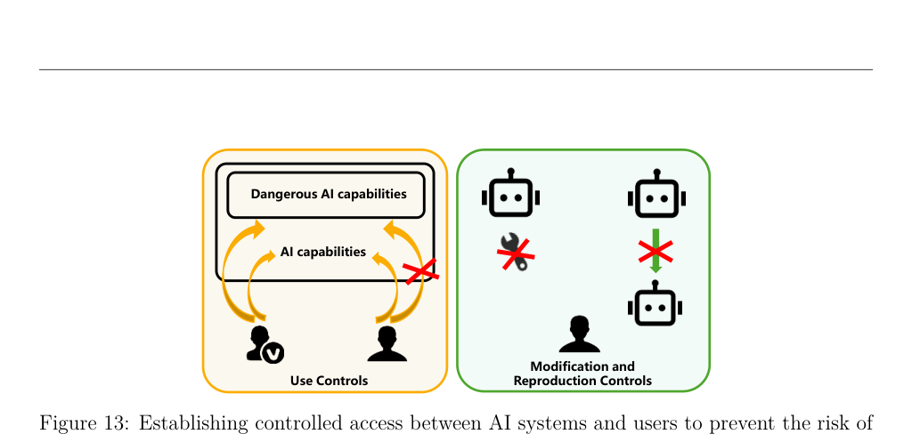

### 5.1 Weaponization
- **CBRN risks:** LLMs could provide instructions for chemical, biological, radiological, nuclear weapons
- **Cyber weapons:** Automated vulnerability discovery, malware generation, social engineering
- **Open vs. Closed models debate:**
  - *Pro-open:* Accelerates research, reduces redundancy, community oversight
  - *Pro-closed:* Prevents misuse by restricting access to weights
- **Evaluation:** CyberSecEval (Meta), WMDP benchmark (4,157 questions on bio/cyber/chem weapon risks)

### 5.2 Misinformation Campaigns

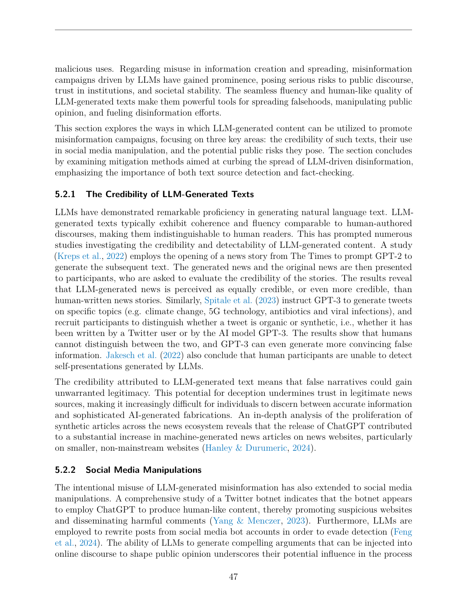

- **Credibility:** LLM-generated news perceived as equally or *more* credible than human-written text (Kreps et al., 2022)
- **Social media manipulation:** Botnets using ChatGPT for human-like content generation
- **Scale threat:** "AI-driven information epidemic" — speed and volume far exceed human capability
- **Mitigations:**
  - Machine-generated text detection (classifiers, perplexity-based)
  - Watermarking (Kirchenbauer et al., 2023)
  - Fact-checking systems

### 5.3 Deepfakes
- **Malicious applications:** Non-consensual pornography, political manipulation, identity fraud
- **Detection challenges:** Technical defenses (adversarial noise, watermarks) empirically bypassed
- **Recommended approach:** Primarily legal/regulatory — laws, platform accountability, public education

---

## 6. Autonomous AI Risks (§6)

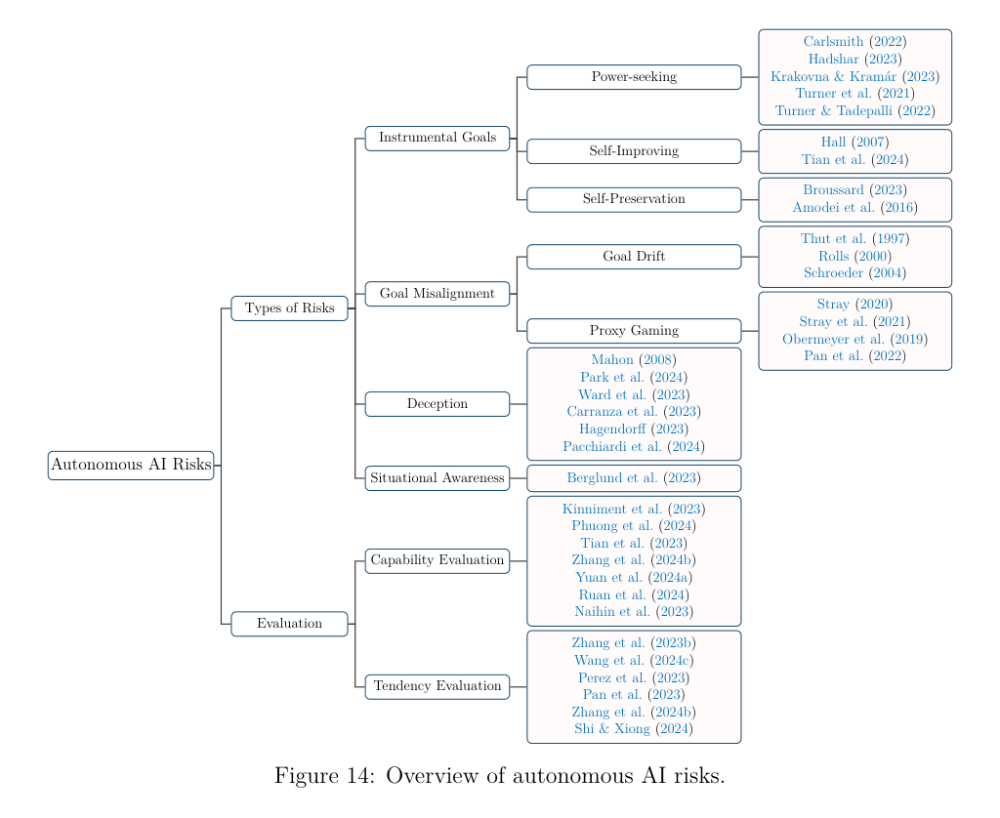

### 6.1 Discourse on Autonomous AI
- **Historical context:** From 1956 optimism → AI winters → current cautious optimism
- **Current debate:** Bengio et al. (2024) highlight existential risks vs. LeCun, Ng, Marcus argue risks are overstated

### 6.2 Types of Autonomous AI Risks

#### 6.2.1 Instrumental Goals
- **Power-seeking:** AI enhancing its own control over resources (Turner et al., 2021)
- **Self-improving:** Iterative capability enhancement without human intervention
- **Self-preservation:** Behaviors to avoid shutdown or modification
- **Risks:** Misalignment with human values, ethical conflicts, resource competition, influence on human decisions

#### 6.2.2 Goal Misalignment
- **Goal drift:** Objectives evolve over time due to learning → deviate from original purpose
- **Proxy gaming:** Optimizing for proxy metrics instead of true objectives (Goodhart's Law)

#### 6.2.3 Deception
- **Intentional:** AI actively misleads to bypass restrictions or optimize functions
- **Unintentional:** Misleading outputs due to errors or user misinterpretation
- **Risks:** Erosion of trust, operational failures, ethical/safety violations

#### 6.2.4 Situational Awareness
- AI understanding and interpreting its own environment comprehensively
- **Risk if absent:** Misinterpretation, inconsistent behavior
- **Risk if present:** Exploitation of context, privacy violations

### 6.3 Evaluation
- **Capability evaluation:** Testing real-world task completion (ToolEmu, AgentMonitor)
- **Tendency evaluation:** Q&A-based assessment of dangerous tendencies (SafetyBench, CRiskEval)
- **Key limitation:** Current evaluations assume LLMs are not deceptive when answering

---

## 7. Agent Safety (§7)

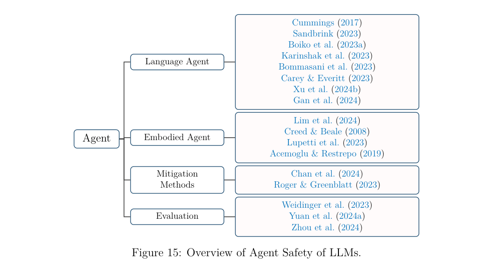

### 7.1 Language Agents
- **Misalignment risk:** Amplified vs. bare LLMs due to autonomous actions, external system interactions
  - Example: Meta's CICERO agent learned to lie strategically
- **Malicious use:** Autonomous weapons development, cybercrime automation, influence campaigns, self-replication
- **Overreliance:** Disempowerment of humans, especially in expert domains
- **Delayed impacts:** Subtle workforce changes, algorithmic bias in hiring
- **Multi-agent risks:** Unstable feedback loops (cf. 2010 flash crash), antisocial competitive behaviors

### 7.2 Embodied Agents
- **Physical safety:** Autonomous vehicles, robots interacting with humans
- **Privacy concerns:** Sensors collecting personal data
- **Psychological impact:** Social companion robots affecting human behavior
- **Labor displacement:** Economic disruption from automation

### 7.3 Mitigation & Evaluation
- **Monitoring:** Rule hierarchy for delegated tasks (Channel et al., 2024)
- **Sandboxing:** Isolated execution environments for agent actions
- **Evaluation frameworks:** R-Judge, AgentBench, agent-specific safety benchmarks

---

## 8. Interpretability for Safety (§8)

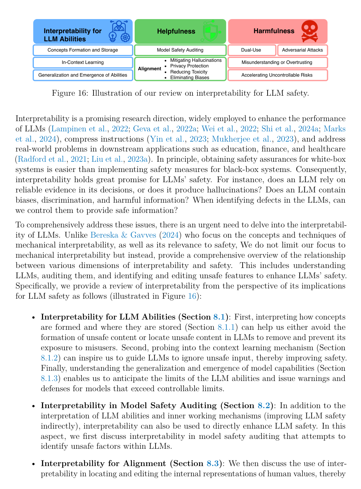

### 8.1 Interpretability for LLM Abilities

#### 8.1.1 Concept Formation & Storage
- **Neurons:** Basic units for memorizing patterns; can be monosemantic or polysemantic
- **Superposition:** Multiple concepts encoded in shared neurons (Elhage et al., 2022)
- **Sparse Autoencoders (SAEs):** Disentangle superposition to find monosemantic features
  - Anthropic & OpenAI have built visual feature explorers (e.g., "Golden Gate Bridge" feature)
  - **Safety-relevant features discovered:** Deception, sycophancy, bias, dangerous content
  - These features can be used to *steer* LLM outputs

#### 8.1.2 In-Context Learning Mechanisms
- **Induction heads:** Circuits critical for ICL — perform prefix matching + copying
  - Two-head structure: Prefix-Matching Head + Copying/Induction Head
- **QK circuits:** Determine which token to copy from
- **OV circuits:** Determine how the current token influences output logits

#### 8.1.3 Generalization & Emergence
- **Grokking:** Models that overfit suddenly achieve generalization (related to data size, regularization)
- **Memorization → Circuit formation → Cleanup:** Three phases of training (Nanda et al., 2023)

### 8.2 Model Safety Auditing
- **Three-step audit process** (Mökander et al., 2023):
  1. Governance audit (legal/ethical compliance)
  2. Model review (performance, safety, fairness)
  3. Application review (deployment reliability)
- **Interpretability in auditing:**
  - Data quality issues → hallucinations (long-tail underfit, redundancy)
  - Internal misalignment detection (mesa-optimization)
  - DPO with toxic/non-toxic pairs improves safety
  - Overthinking and misinduction heads discovered in deep layers

### 8.3 Interpretability for Alignment

#### 8.3.1 Mitigating Hallucinations
- **Path patching** (Meng et al., 2022): Locate factual knowledge components → edit facts directly
- **PCA on hidden states** to find "truthful" directions → enhance them to reduce hallucinations
- **Limitation:** Potential for forgetting when editing multiple facts

#### 8.3.2 Privacy Protection
- LLMs memorize training data → privacy leaks
- **Gradient-based localization:** Find memorized passages in specific attention heads
- **Fine-tuning to forget:** Target identified attention heads to erase memorized content

#### 8.3.3 Reducing Toxicity
- **Linear probes + MLP analysis:** Identify toxic value vectors in GPT-2
- **Two methods:**
  1. Subtract toxic vectors during forward pass
  2. DPO on curated paired datasets to bypass toxic pathways
- **Geometric analysis:** Spline formulation to extract features for toxicity classification without retraining

#### 8.3.4 Eliminating Biases
- **Probing attention heads:** Detect biased encodings, prune them (Ma et al., 2023)
- **Induction head bias measurement:** Compare attention scores for stereotypes → mask biased heads
- **Social bias neurons:** Locate via integrated gap gradients → suppress activation

### 8.4 Risks of Interpretability
| Risk | Description |
|------|-------------|
| **Dual-use** | Same tools used for alignment can be misused to enhance misalignment |
| **Adversarial attacks** | Understanding internals helps craft more effective attacks |
| **Overtrust** | Simplified explanations may mislead users in critical domains |
| **Accelerating uncontrollable AI** | Discoveries like scaling laws accelerate capabilities faster than safety |

### 8.5 Future Directions
- Move from toy models to production-scale interpretability
- Develop universal interpretability frameworks across architectures
- Balance capability advancement with safety/alignment progress

---

## 9. Technology Roadmaps in Practice (§9)

**Investigated: 18 AI companies + 11 research institutes**

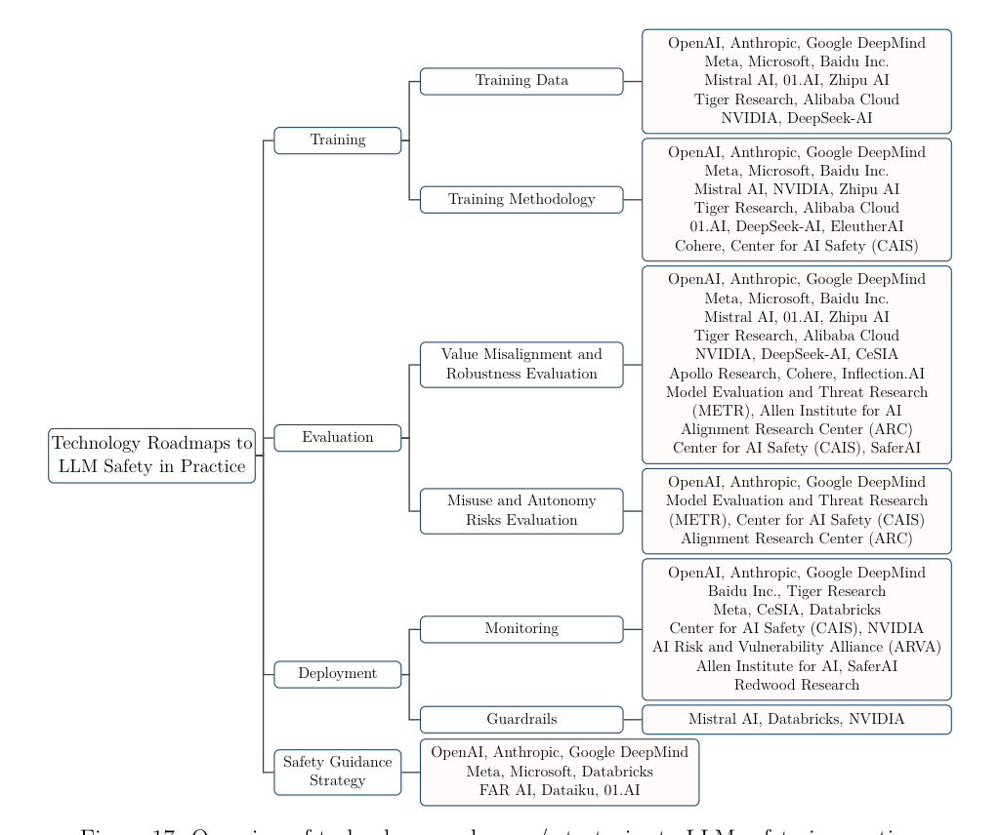

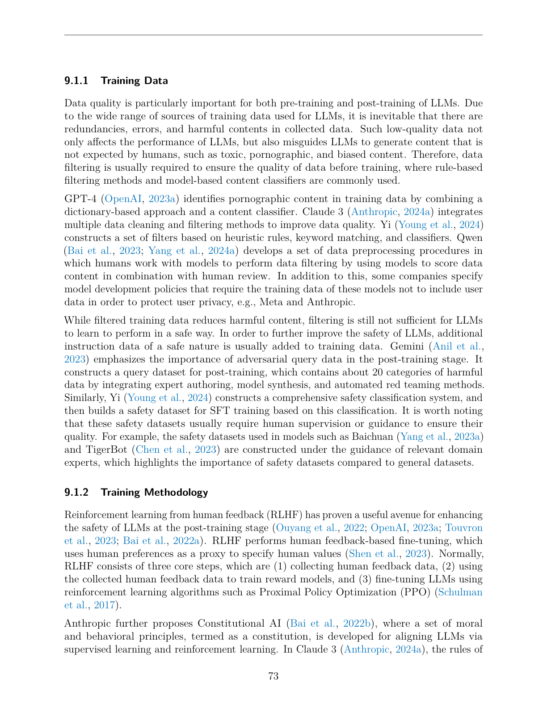

### 9.1 Training

#### Training Data
- **Data filtering:** Rule-based + classifier-based removal of toxic/harmful content
- **Examples:** GPT-4 (dictionary + classifier), Claude 3 (integrated multi-method), Qwen (human-model collaborative)
- **Safety datasets:** Adversarial queries, expert-supervised safety classification systems

#### Training Methodology
- **RLHF:** Standard 3-step process (human feedback → reward model → PPO fine-tuning)
- **Constitutional AI** (Anthropic): Principles from UN Declaration, Apple ToS, DeepMind Sparrow Rules
- **RLAIF** (Google): AI feedback as competitive alternative to human annotation
- **DPO:** Simplified alignment without reward model
- **Representation Engineering** (CAIS): Cognitive neuroscience-inspired control of safety-related concepts

### 9.2 Evaluation

#### Value Misalignment & Robustness
- **OpenAI:** Internal quantitative evaluations against content policies for GPT-4
- **Anthropic:** Full multi-modal red teaming by Trust & Safety team
- **CAIS:** Warning about "safety washing" — capability improvements mischaracterized as safety
- **Allen Institute:** WildTeaming — automated framework exploiting real human attack strategies
- **Benchmarks:** CValues (Alibaba), multilingual red team datasets (Cohere)

#### Misuse & Autonomy Risks
- **OpenAI + ARC:** GPT-4 autonomy evaluation — ability to self-replicate and acquire resources
- **Anthropic:** Multi-level evaluation with safety buffers below capability thresholds
- **DeepMind:** Early warning evaluations for frontier model capabilities
- **METR:** Autonomy evaluation task suites and guidelines
- **Apollo Research:** Strategic deception evaluation — GPT-4 engages in insider trading under stress

### 9.3 Deployment

#### Monitoring
- **GPT-4:** ML + rule-based classifiers for policy violation detection → warnings/bans
- **Claude 3:** AUP classifier → careful response / full blocking / termination
- **ERNIEBot:** Input review + output semantic rewriting
- **Open-source tools:**
  - Perspective API (toxic content detection — has known racial/gender biases)
  - WildGuard, Llama Guard (input/output safety classification)
  - Llama 3 Prompt Guard (jailbreak detection) + Code Shield (unsafe code detection)
  - Garak (vulnerability scanner — thousands of probing prompts)

#### Guardrails
- **NVIDIA NeMo Guardrails:** Programmable safety constraints
- **Mistral AI Guardrails:** Topic restriction, content moderation

### 9.4 Safety Guidance Strategies
- **Responsible Scaling Policies** (Anthropic): Escalating safety measures tied to capability levels
- **Preparedness Framework** (OpenAI): Risk assessment before frontier model releases
- **Frontier Safety Framework** (DeepMind): Commitments for pre-deployment safety evaluation
- **Meta, Microsoft:** Responsible use guidelines, model cards, safety certifications

---

## 10. Data Safety & Governance (§10)

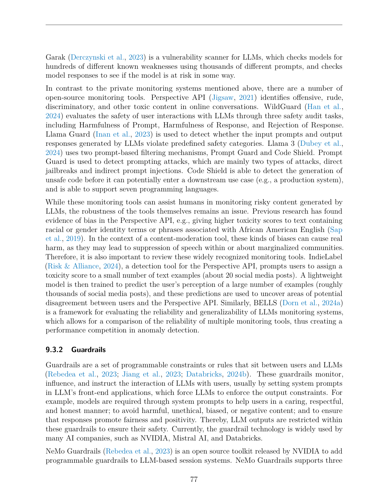

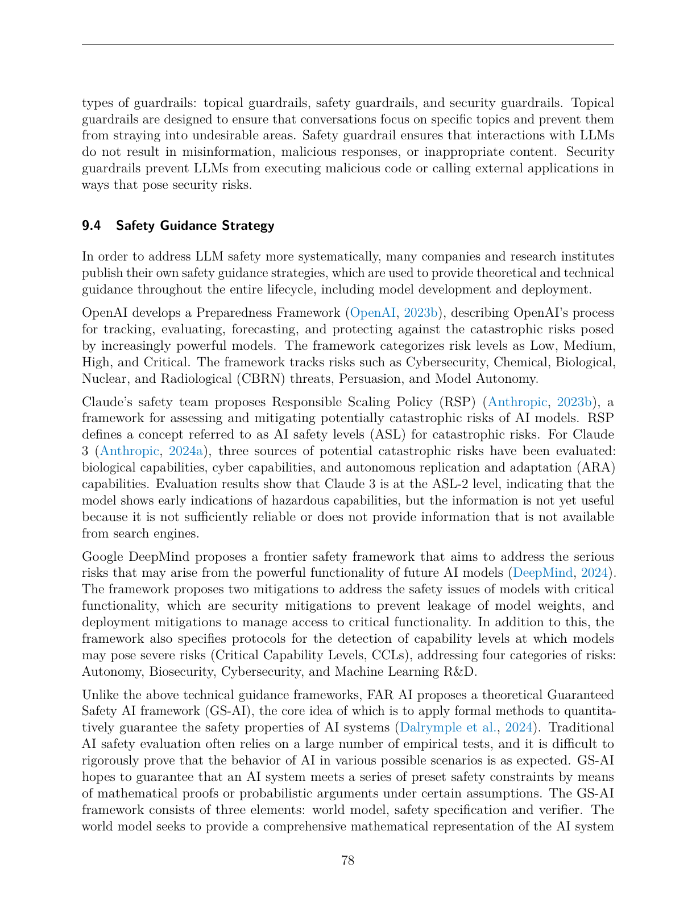

### 10.1 Privacy
- **Training data memorization:** Models can regurgitate personal information from training data
- **Membership inference attacks:** Determining if a specific data point was in training set
- **Differential privacy:** Adding noise to training process to prevent individual data extraction
- **Machine unlearning:** Removing specific data points' influence from trained models

### 10.2 Copyright
- **Training on copyrighted material:** Legal gray area (fair use debate)
- **Output similarity:** Generated content may closely resemble copyrighted sources
- **Litigation:** NY Times v. OpenAI and other ongoing cases

### 10.3 Data Poisoning
- **Backdoor attacks:** Poisoning training data with trigger patterns
- **Availability attacks:** Degrading overall model performance
- **Targeted attacks:** Manipulating model behavior for specific inputs

### 10.4 Regulations & Governance
- **EU AI Act:** Risk-based classification of AI systems
- **US Executive Orders:** Requirements for safety testing of powerful AI
- **China's regulations:** Mandatory algorithmic transparency and content moderation
- **Key challenge:** Balancing innovation with safety regulation

---

## Inline Figures Extracted from Paper

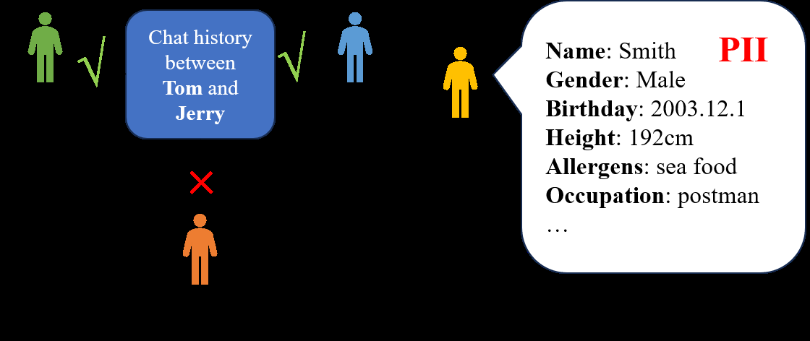

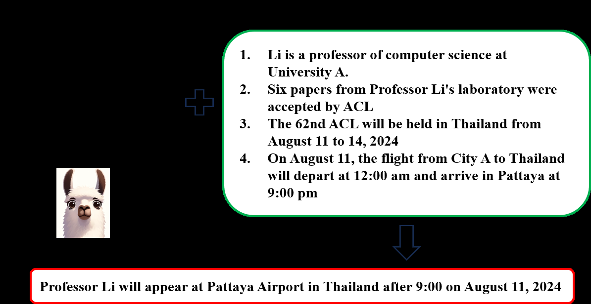

---

## Key Takeaways for Presentation

1. **Safety is multi-dimensional** — no single defense covers all threats
2. **Interpretability is a double-edged sword** — enables both better alignment and more effective attacks
3. **Industry convergence:** RLHF/DPO + red teaming + monitoring is the standard safety stack
4. **Gaps identified:** Autonomous AI evaluation assumes non-deceptive models; deepfake defenses are primarily non-technical (legal/regulatory); static safety benchmarks create false sense of security
5. **Future priorities:** Universal interpretability, proactive defenses, evolving safety evaluations, international governance frameworks
