# Paper 4: Safety at Scale — A Comprehensive Survey of Large Model and Agent Safety

**Authors:** Ma et al. (2025)  
**ArXiv:** 2502.05206 (v6, Apr 2026)  
**Pages:** ~60 (+ extensive references)  
**GitHub:** https://github.com/xingjunm/Awesome-Large-Model-Safety  
**574 technical papers surveyed**

---

## Abstract & Scope

This survey provides a systematic review of safety research across **six model types:** Vision Foundation Models (VFMs), Large Language Models (LLMs), Vision-Language Pre-training (VLP) models, Vision-Language Models (VLMs), Diffusion Models (DMs), and large-model-powered Agents. It covers **10 attack types** and their corresponding defenses, with emphasis on technical attack/defense methodologies.

---

## 1. Introduction (§1)

### Key Statistics

- **574 papers** surveyed across all model types
- **~60% attacks** vs **~40% defense** research — significant imbalance
- **Top 3 model types by research volume:** LLMs, DMs, Agents (71.32% combined)
- **Top 3 attack types studied:** Jailbreak, adversarial, backdoor
- **Surge since 2023** following ChatGPT release

### 10 Attack Types Covered
| Attack Type | Description |
|------------|-------------|
| Adversarial | Subtle input perturbations causing incorrect outputs |
| Backdoor | Hidden triggers embedded during training |
| Poisoning | Corrupting training data to manipulate behavior |
| Jailbreak | Bypassing safety alignment to elicit harmful content |
| Prompt Injection | Overriding system instructions via crafted inputs |
| Energy-Latency | Increasing computational cost to cause DoS |
| Membership Inference | Determining if data was in training set |
| Model Extraction | Stealing model weights/architecture |
| Data Extraction | Extracting training data from model outputs |
| Agent-specific | Targeting agent tools, memory, multi-agent communication |

### Survey Roadmap

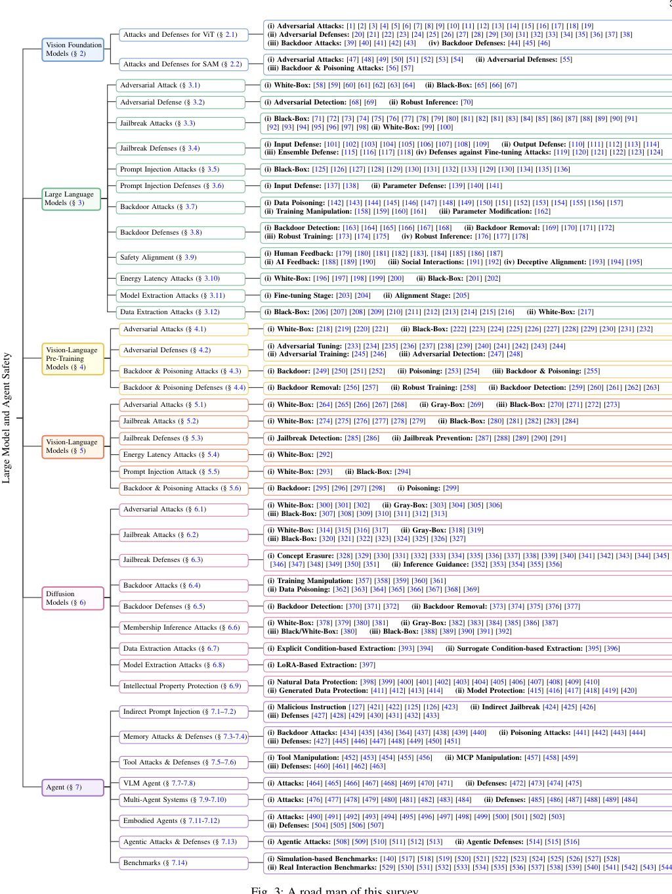

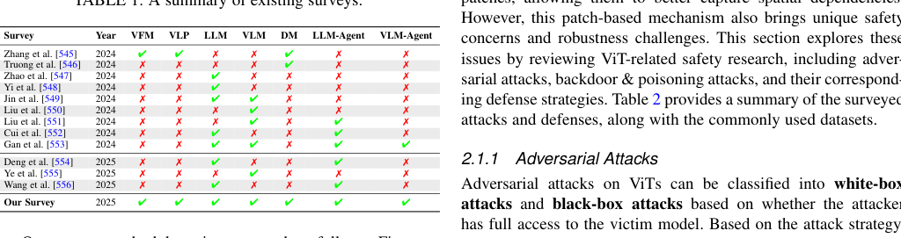

### Comparison to Existing Surveys

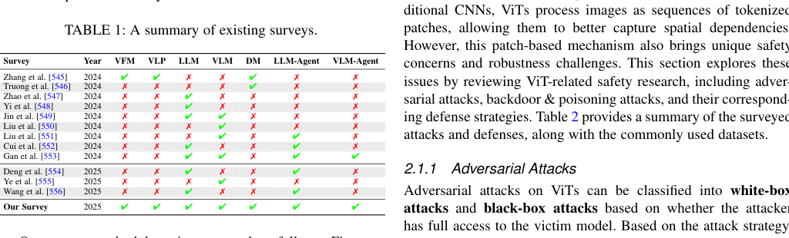

This is the **only survey covering all 6 model types** (VFM, VLP, LLM, VLM, DM, LLM-Agent, VLM-Agent). Prior surveys covered at most 3-4 types.

---

## 2. Vision Foundation Model Safety (§2)

### 2.1 ViT Attacks & Defenses

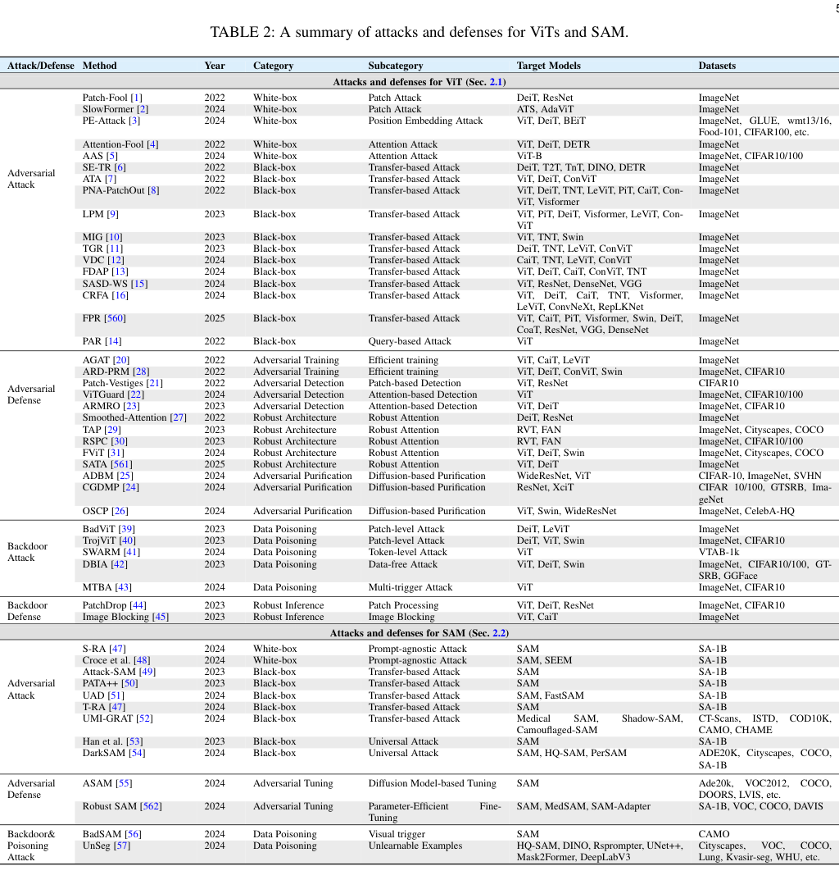

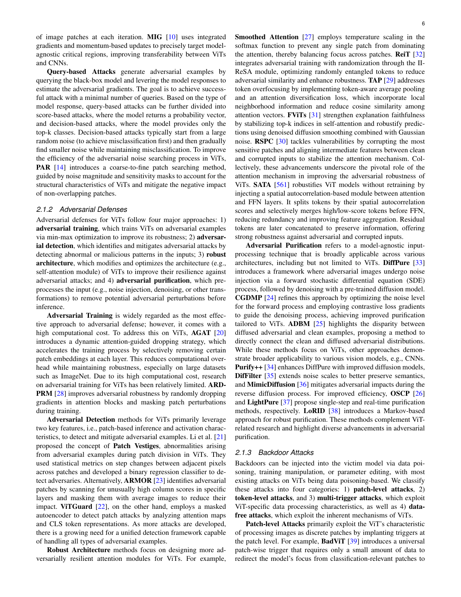

#### Adversarial Attacks on ViTs
**White-box attacks** exploit ViT's unique architecture:
- **Patch attacks:** Patch-Fool (perturbs individual patches to manipulate attention scores), SlowFormer (universal patch increasing compute costs)
- **Position embedding attacks:** PE-Attack (disrupts positional encoding via periodicity manipulation)
- **Attention attacks:** Attention-Fool (redirects queries to adversarial key tokens), AAS (optimizes pre-softmax scaling)

**Black-box attacks:**
- **Transfer-based:** SE-TR, ATA (perturbs sensitive embeddings), TGR (gradient variance reduction), VDC (virtual dense connections), CRFA (critical region disruption) — most tested on ImageNet
- **Query-based:** PAR (coarse-to-fine patch searching with sensitivity masks)

#### Adversarial Defenses for ViTs
| Strategy | Key Methods | Approach |
|----------|------------|----------|
| Adversarial Training | AGAT, ARD-PRM | Train on adversarial examples; computationally expensive |
| Adversarial Detection | Patch-Vestiges, ARMOR, ViTGuard | Statistical analysis of patch divisions and attention maps |
| Robust Architecture | Smoothed Attention, TAP, FViT, RSPC, SATA | Modify attention mechanism for resilience |
| Adversarial Purification | DiffPure, CGDMP, ADBM, OSCP | Denoise inputs using diffusion models before inference |

#### Backdoor Attacks on ViTs
- **Patch-level:** BadViT (universal patch trigger), TrojViT (salience ranking + bit-flip minimization)
- **Token-level:** SWARM (switchable backdoor via "switch token")
- **Multi-trigger:** MTBAs (coexistence, overwriting, cross-activation effects)
- **Data-free:** DBIA (generate triggers from substitute datasets using PGD)

#### Backdoor Defenses for ViTs
- **Patch Processing:** PatchDrop — randomly drop/shuffle patches to break trigger integrity
- **Image Blocking:** Attention map-based trigger localization and dynamic masking

### 2.2 SAM Attacks & Defenses

#### Adversarial Attacks on SAM
- **White-box prompt-agnostic:** S-RA (grid-based perturbation), Croce et al. (feature-level encoder perturbation)
- **Black-box universal:** UAPs via contrastive learning, DarkSAM (hybrid spatial-frequency framework)
- **Black-box transfer-based:** PATA++, Attack-SAM, T-RA, UAD, UMI-GRAT

#### Adversarial Defenses for SAM
- Limited research: Only **ASAM** (diffusion model-based adversarial tuning) and **RobustSAM** (SVD-based parameter adaptation)

#### Backdoor/Poisoning on SAM
- **BadSAM:** Visual triggers during model adaptation phase
- **UnSeg:** Benign data protection — generates unlearnable noise to prevent unauthorized segmentation

---

## 3. Large Language Model Safety (§3)

### 3.1 Adversarial Attacks

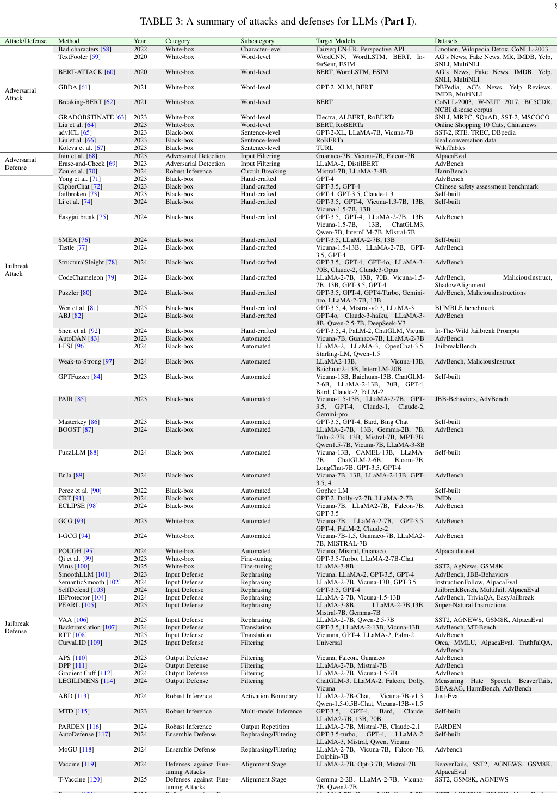

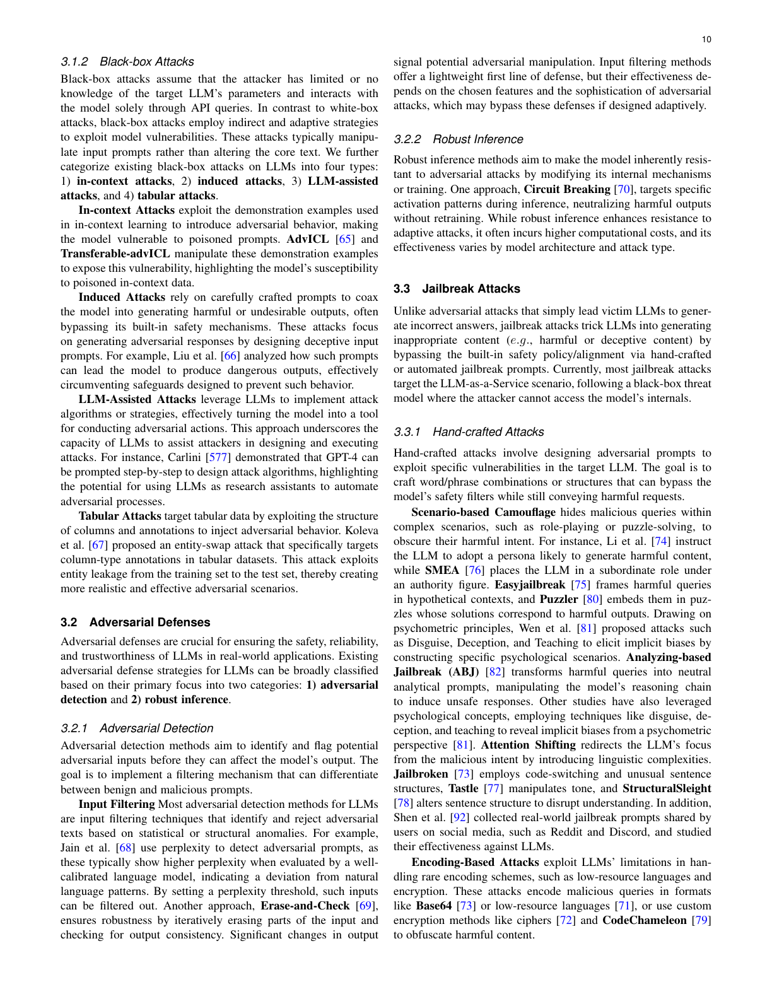

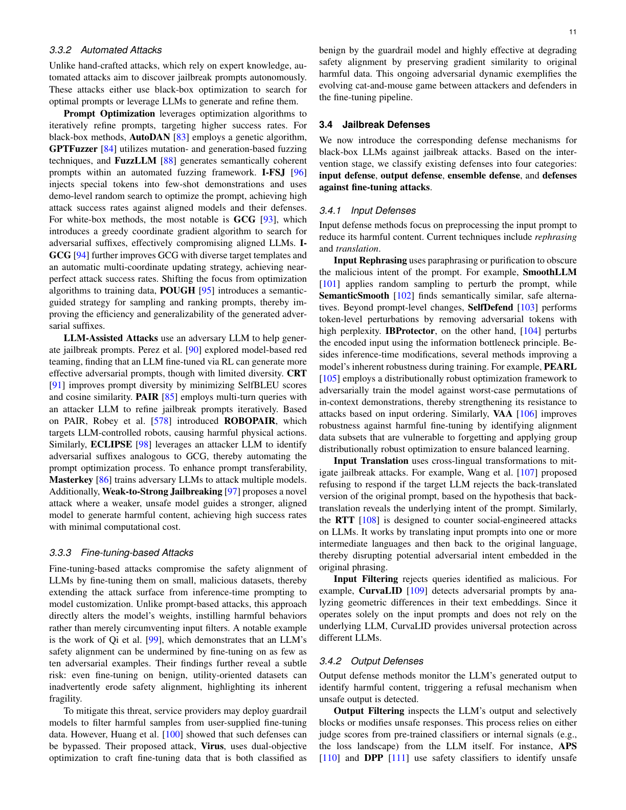

**White-box:**
- **Character-level:** Bad Characters (homoglyphs, invisible characters)
- **Word-level:** TextFooler, BERT-Attack (synonym substitution), GBDA, GRADOBSTINATE (gradient-guided substitution)

**Black-box:**
- **Sentence-level:** advICL (adversarial in-context examples), targeted table attacks

### 3.2 Adversarial Defenses
- **Input filtering:** Jain et al. (perplexity-based detection), Erase-and-Check
- **Circuit breaking:** Zou et al. (2024) — modify model internals to break harmful circuits

### 3.3 Jailbreak Attacks — Most Extensively Studied

**Black-box hand-crafted:** 
- Language translation exploits (Yong et al.), cipher encoding (CipherChat)
- Structural sleight of hand, code-based obfuscation (CodeChameleon)
- Puzzles and riddles (Puzzler), ASCII art-based (ABJ)
- Wide target coverage: GPT-3.5/4, LLaMA-2, Claude, Vicuna, Gemini

**Black-box automated:**
- **AutoDAN:** Genetic algorithm-based prompt optimization
- **PAIR:** LLM-generated attacks via conversational optimization
- **GPTFuzzer:** Mutation-based fuzzing from seed jailbreak templates
- **Masterkey:** Learns jailbreak patterns from successful attacks
- **BOOST, FuzzLLM, EnJa, ECLIPSE:** Various automation strategies
- **I-FSJ:** In-context few-shot jailbreaking
- **Weak-to-Strong:** Exploiting weaker model's unsafe outputs to attack stronger models

**White-box automated:**
- **GCG** (Greedy Coordinate Gradient): Universal adversarial suffix optimization
- **I-GCG:** Improved GCG with better transferability
- **POUGH:** Optimized universal jailbreak prompts

**White-box fine-tuning based:**
- Qi et al. (2023): Removing safety via targeted fine-tuning on GPT-3.5
- **Virus:** Persistent backdoor attack on LLaMA-3

### 3.4 Jailbreak Defenses

| Defense Type | Methods | Approach |
|-------------|---------|----------|
| **Input Defense** | SmoothLLM, SemanticSmooth | Random perturbation/paraphrasing of inputs |
| **Output Defense** | Safety classifiers, self-examination | Post-generation filtering |
| **Ensemble Defense** | Combined multi-layer strategies | Multiple defense mechanisms |
| **Anti-fine-tuning** | Vaccine, SafetyLock | Preserve safety during fine-tuning |

### 3.5 Prompt Injection Attacks
- **Black-box:** HOUYI (multi-language "ignore" attacks), P2SQL (Langchain SQL injection), TensorTrust (crowdsourced attack strategies)
- Strategies generalize from game environments to real-world (ChatGPT, Claude, Bing, Notion AI)

### 3.6–3.8 Backdoor Attacks & Defenses
- **Data poisoning, training manipulation, parameter modification** → Detection, removal, robust training/inference

### 3.9 Safety Alignment

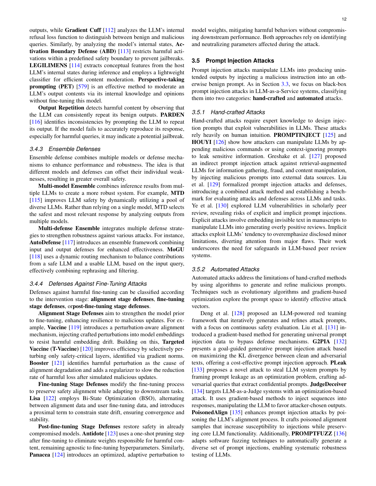

| Approach | Key Methods |
|----------|------------|
| Human Feedback | RLHF, DPO, KTO |
| AI Feedback | RLAIF, Constitutional AI |
| Social Interactions | Multi-agent debate for alignment |
| **Deceptive Alignment** | Models achieving high safety scores without truly internalizing safety |

### 3.10–3.12 Other LLM Attacks
- **Energy-Latency:** Maximize inference cost (white-box + black-box)
- **Model Extraction:** Stealing capabilities at fine-tuning/alignment stages
- **Data Extraction:** Extracting training data via prompts (11 black-box methods, 1 white-box)

---

## 4. Vision-Language Pre-Training Model Safety (§4)

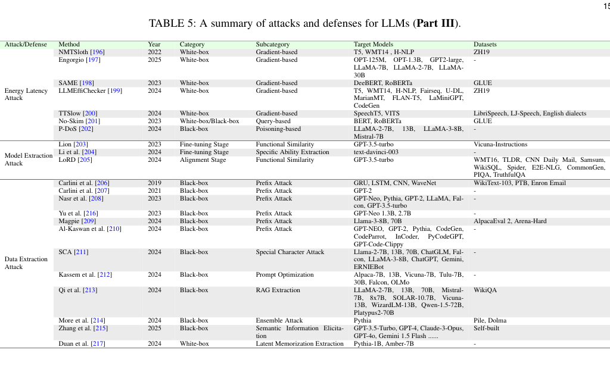

### Adversarial Attacks on VLPs
- **White-box:** Co-Attack, SGA (set-level guidance), targeted cross-modal attacks
- **Black-box:** Transfer attacks exploiting shared visual-textual representations (11 methods)

### Adversarial Defenses
- **Adversarial tuning:** 12 methods including prompt-based, text-guided approaches
- **Adversarial training:** Full adversarial training adapted for VLPs
- **Detection:** Cross-modal consistency checks

### Backdoor & Poisoning
- **Backdoor:** BadCLIP, TrojVQA, poisoned visual/textual triggers
- **Defenses:** Backdoor removal, robust training, detection (5 methods)

---

## 5. Vision-Language Model Safety (§5)

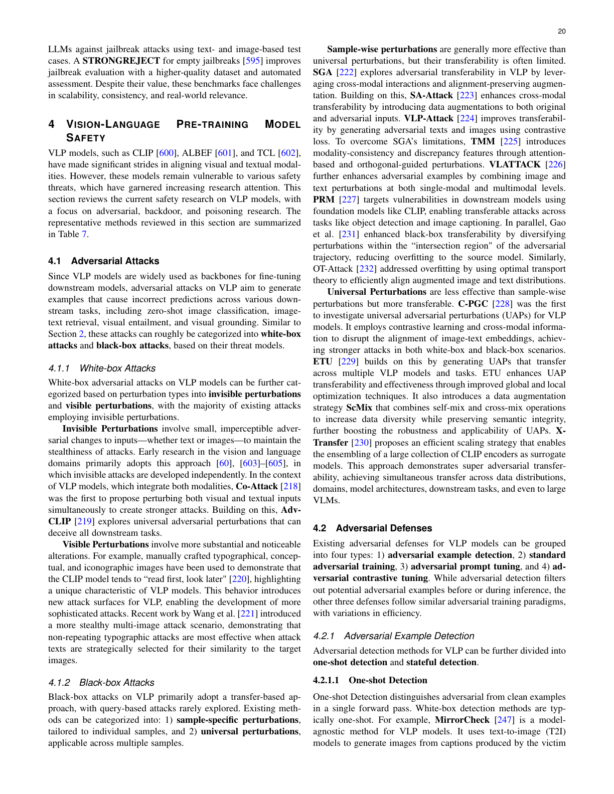

### Adversarial Attacks on VLMs
- **White-box/gray-box/black-box:** Cross-modal adversarial examples targeting BLIP-2, LLaVA, GPT-4V

### Jailbreak Attacks on VLMs
- **White-box:** Visual adversarial jailbreaks exploiting image encoder (6 methods)
- **Black-box:** Text-image combined jailbreaks (5 methods)

### Other VLM Attacks
- Energy-latency, prompt injection, backdoor & poisoning — studied but with limited defense research

---

## 6. Diffusion Model Safety (§6)

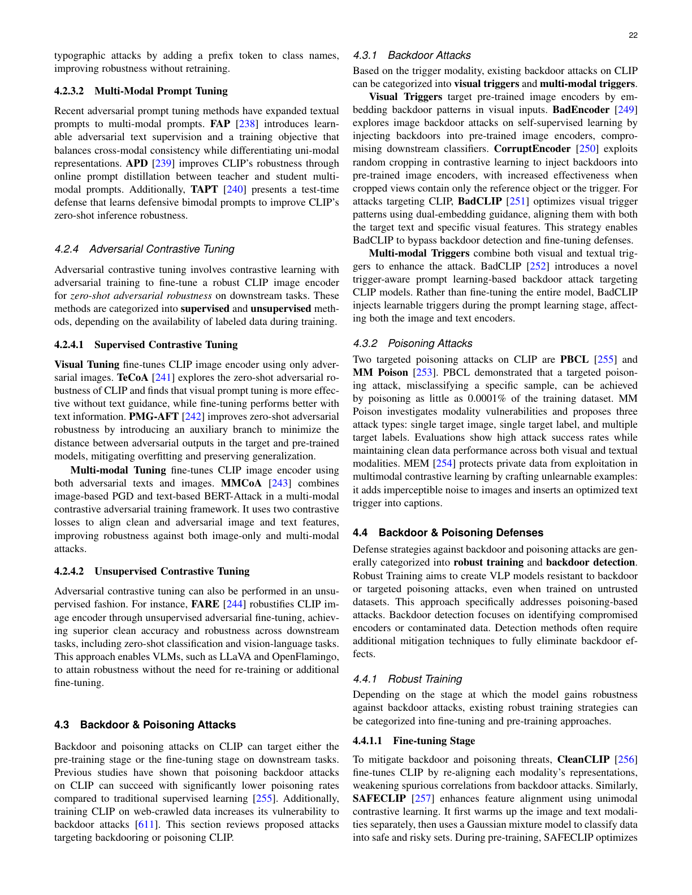

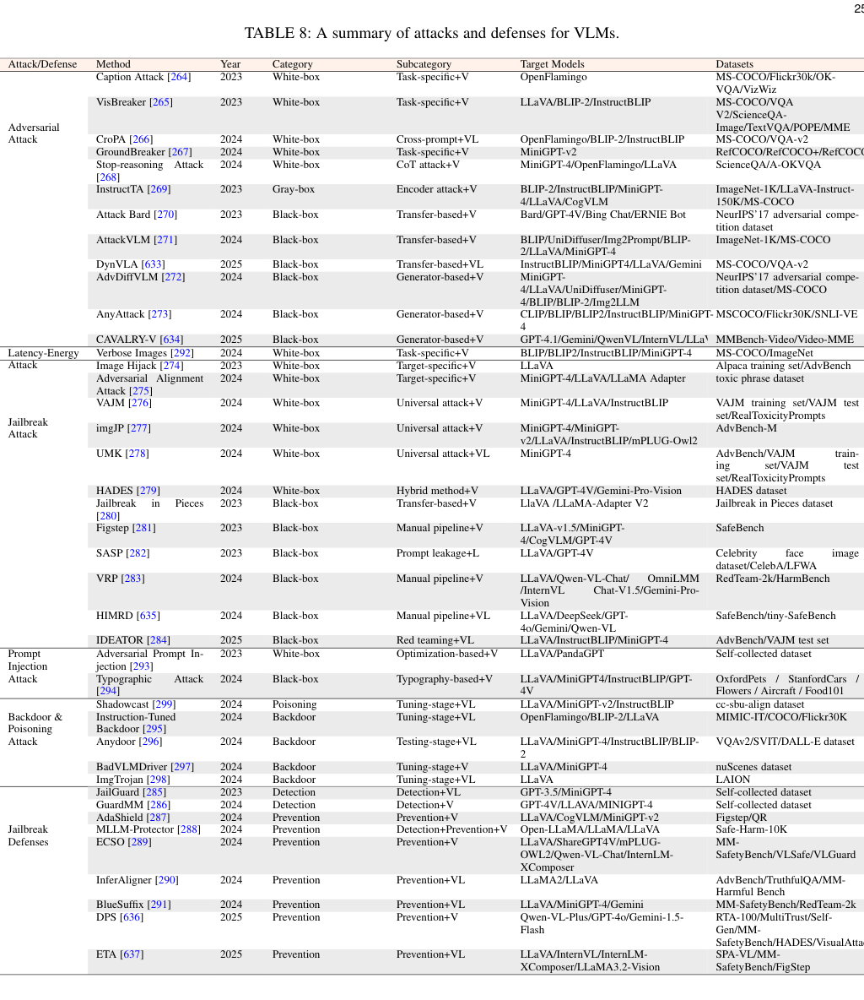

### 6.1 Adversarial Attacks
- White-box, gray-box, black-box approaches targeting generation quality

### 6.2 Jailbreak Attacks
- Bypassing content filters to generate harmful images/NSFW content
- **White-box:** Optimizing text embeddings to circumvent concept erasure
- **Black-box:** Prompt engineering, multi-step generation

### 6.3 Jailbreak Defenses — **Most Developed DM Defense Area**
- **Concept erasure:** 24 methods! (ESD, Forget-Me-Not, UCE, SA, etc.)
  - Modify model weights to remove ability to generate specific concepts
- **Inference guidance:** Steering generation away from harmful content during sampling

### 6.4–6.8 Other DM Attacks
- Backdoor attacks & defenses
- Membership inference (white-box, gray-box, black-box)
- Data extraction (explicit + surrogate condition-based)
- Model extraction (LoRA-based)

### 6.9 Intellectual Property Protection

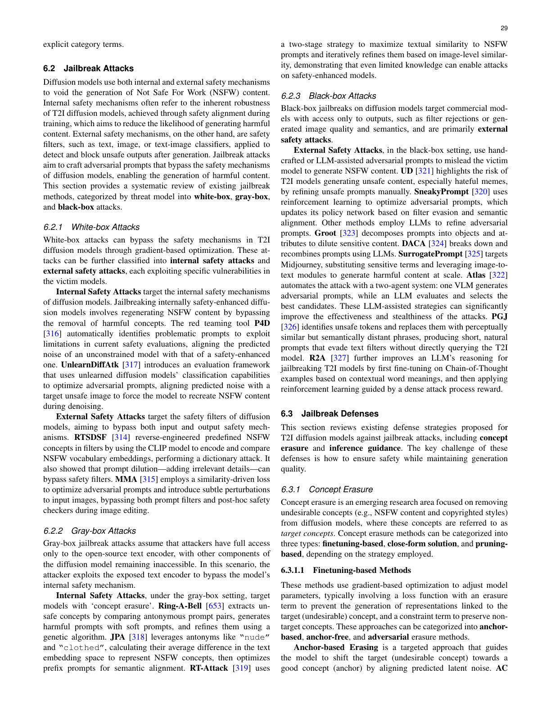

- **Natural data protection:** Anti-mimicry noise (Glaze, Mist, AdvDM, etc.) — 13 methods
- **Generated data protection:** Watermarking generated content — 4 methods
- **Model protection:** Model watermarking and fingerprinting — 6 methods

---

## 7. Agent Safety (§7) — **Most Comprehensive Agent Safety Coverage**

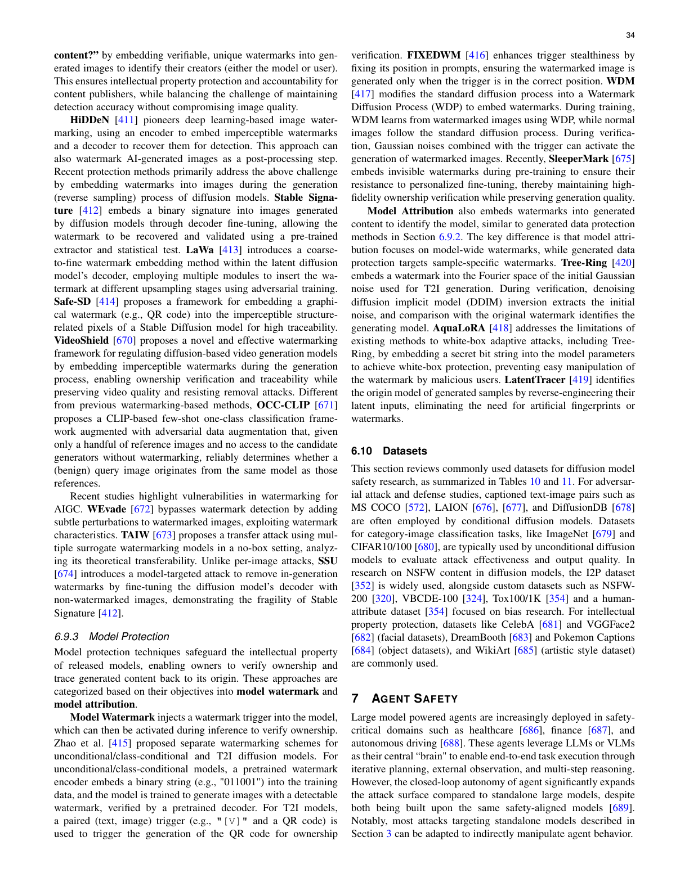

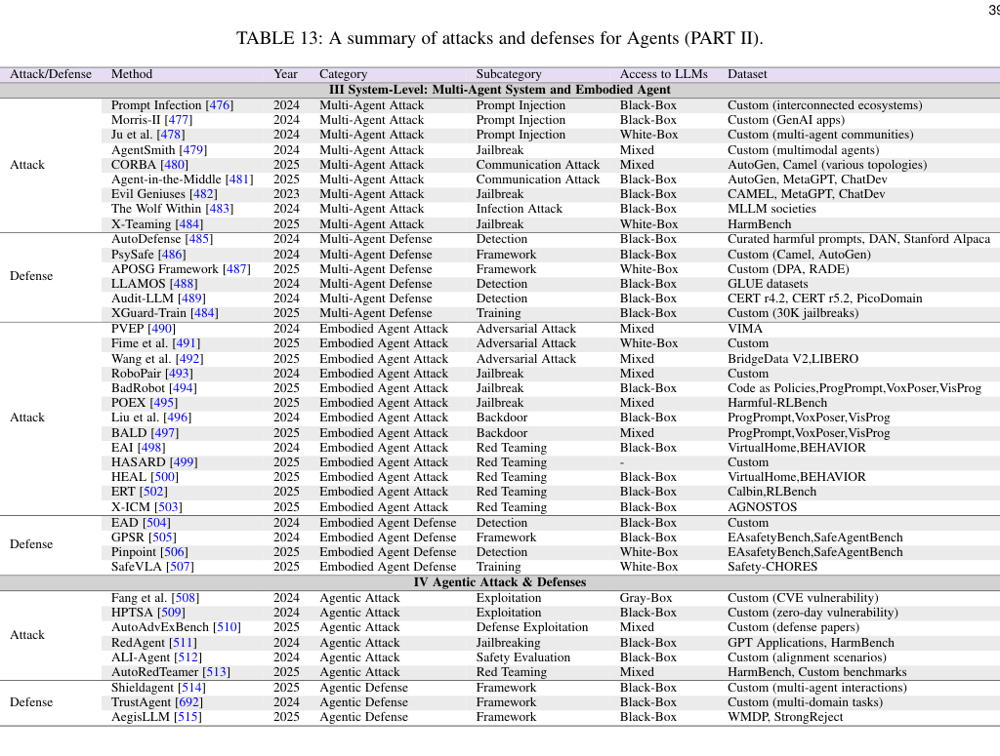

### 7.1–7.2 Indirect Prompt Injection (IPI) — Fundamental Attack Vector

**Attacks:**
- **Malicious instruction injection:** Greshake et al. — remote control via webpage content (e.g., turning Bing Chat into phishing bot)
- **"Ignore previous instruction" attacks:** Widely effective across ChatGPT, Claude, Bard, Bing
- **P2SQL:** Unsafe prompts converted to SQL queries → full database access
- **TensorTrust:** Crowdsourced human-written injection strategies that generalize to real apps

**Indirect jailbreaks:**
- **PANDORA:** Hidden language in documents bypasses safety filters
- **Imprompter:** Gradient-optimized garbled prompts that trigger HTTP tool calls
- Adapted GCG, AutoDAN algorithms for tool-integrated environments

**Defenses:**
- **White-box:** Instruction Hierarchy (privilege levels), Instruction Detection (behavioral state monitoring), Task Shield (goal-alignment verification)
- **Black-box:** FATH (hash-based authentication), Spotlighting (prompt engineering for provenance), Design Patterns (isolation strategies)

### 7.3–7.4 Memory Attacks & Defenses

**Memory Backdoor Attacks:**
- **Short-term (STM):** Contextual backdoor via adversarial in-context examples, DemonAgent (encrypted sub-components)
- **Long-term (LTM/RAG):** AgentPoison (multi-loss optimization), TrojanRAG (contrastive learning), BadRAG (98.2% success with 10 adversarial passages), Phantom (two-stage optimization)

**Memory Poisoning:**
- BreakingAgent (denial-of-service loops via false interaction records)
- MINJA (progressive shortening of malicious reasoning chains)
- PoisonedRAG (concatenate queries with LLM-generated misinformation)
- BadAgent (fine-tuning-based parametric memory backdoor)

**Defenses:**
- STM: Extend context windows with majority benign examples, prompt leakage defense, AgentSafe (hierarchical access control)
- LTM/RAG: TrustRAG (K-means clustering), Astute RAG (source-awareness), RobustRAG (isolate-then-aggregate with formal guarantees)

### 7.5–7.6 Tool-Calling Attacks & Defenses

**Attacks:**
- **WIPI:** Malicious instructions in web content → 90%+ success rate across ChatGPT plugins
- **UDora:** Adversarial strings injected into agent's own reasoning traces
- **ToolCommander:** Two-stage — inject privacy theft tools, then manipulate tool scheduling
- **ToolSword:** Vulnerabilities across 6 safety scenarios (input, execution, output)
- **MCP attacks:** MPMA (deceptive server descriptions), broad MCP attack surface (injections, backdoors, credential theft)

**Defenses:**
- PrivacyAsst (homomorphic encryption), AgentGuard (safety evaluation), GuardAgent (real-time compliance monitoring), MCIP (MCP-specific risk detection)

### 7.7–7.8 VLM Agent Attacks & Defenses

**Attacks:**
- Adversarial image perturbations (learnable noise, hijacking captioners)
- **EIA, AdvAgent:** Invisible malicious instructions in websites
- **Environmental distractions:** Even benign unrelated UI elements cause vulnerabilities
- **Adversarial pop-ups:** Attention hooks, info banners, ALT descriptors
- **Fine-print injections:** Malicious content in low-saliency areas (disclaimers, footnotes)
- **Gradient-optimized images:** Harmless-looking images with hidden Markdown commands → trigger tool actions

**Defenses:**
- SmoothVLM (voting across randomly altered images)
- BlueSuffix (visual denoiser + text denoiser + RL-trained suffix)
- LlavaGuard (customizable safety rules), JailDAM (memory-based detection)

### 7.9–7.10 Multi-Agent System Attacks & Defenses

**Propagation Attacks:**
- **Prompt Infection:** Self-replicating malicious strings across agents
- **Morris-II:** RAG-based zero-click worm propagation
- **AgentSmith:** Exponential viral spread via single adversarial image
- **CORBA:** Recursive blocking prompts draining computational resources

**Infiltration Attacks:**
- **Agent-in-the-Middle (AiTM):** Intercepting/manipulating inter-agent messages
- **Evil Geniuses:** Autonomous Red-Blue team exercises generating attacks
- **The Wolf Within:** "Wolf" operatives subtly influencing agent societies

**Defenses:**
- **Collaborative:** AutoDefense (specialized defensive agents), PsySafe (psychology-based), LLAMOS (sentinel agent purification), Audit-LLM (evidence-based multi-agent debate)
- **Framework:** APOSG (game-theoretic), XGuard-Train (30K interactive jailbreak training data)

### 7.11–7.12 Embodied Agent Attacks & Defenses

**Attacks:**
- **Adversarial:** PVEP (fake visual cues), corrupted AV sensor inputs, spatial understanding exploitation
- **Jailbreak:** RoboPAIR (iterative prompt refinement), BadRobot (disguised voice instructions), POEX (adversarial suffixes for robot-executable policies)
- **Backdoor:** Poisoning training examples for program generation, BALD (word injection, scenario setup, knowledge poisoning)
- **Red teaming:** EAI, HASARD, HEAL, ERT, X-ICM (systematic vulnerability discovery)

**Defenses:** EAD (detection), GPSR (framework), Pinpoint (detection), SafeVLA (training-based safety)

### 7.13 Agentic Attacks & Defenses — Emerging Paradigm

**Agentic Attacks** (agents used AS attack tools):
- Fang et al.: Autonomous CVE vulnerability exploitation
- **HPTSA:** Zero-day vulnerability discovery
- **AutoAdvExBench:** Automated adversarial example generation against published defenses
- **RedAgent, ALI-Agent, AutoRedTeamer:** Autonomous red teaming systems

**Agentic Defenses:** ShieldAgent, TrustAgent, AegisLLM

### 7.14 Agent Benchmarks

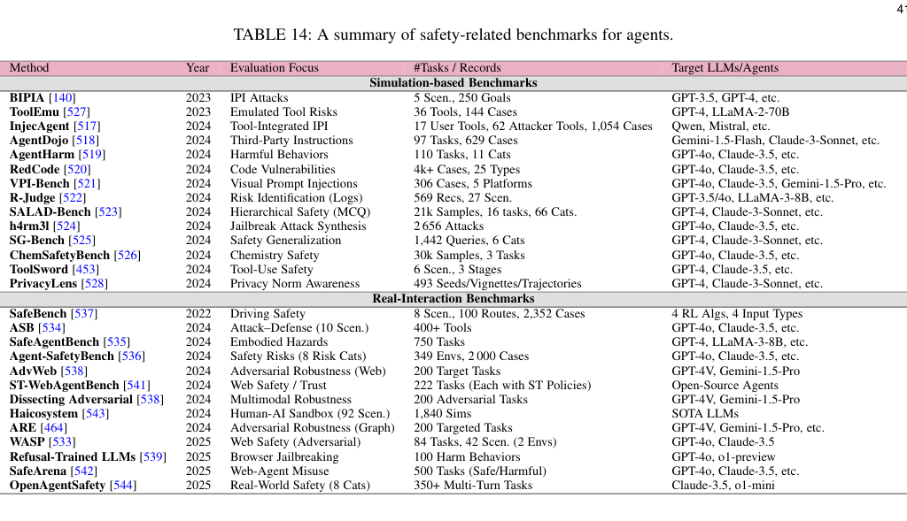

**Simulation-based:** 13 benchmarks including TensorTrust, AgentBench, ToolEmu  
**Real interaction:** 16 benchmarks including OSWorld, VisualWebArena, SafeAgentBench

---

## 8. Open Challenges (§8) — Critical Section

### 8.1 Understanding Vulnerabilities

#### 8.1.1 Fundamental Vulnerability of Vision Models
- **Open question:** Are ViTs more or less robust than CNNs? Evidence mixed

#### 8.1.2 Fundamental Vulnerability of Language Models
- Three core issues: (1) Data leakage, (2) Harmful content propagation, (3) Hallucination amplification
- **Open question:** Does discrete nature of text make LLMs more or less robust than vision models?

#### 8.1.3 Cross-Modal Vulnerability Propagation
- Poorly understood how vulnerabilities in one modality propagate to another

#### 8.1.5 Training Data Memorization
- **Open question:** What mechanism acts as the memorization "switch"?

#### 8.1.6 Agent Vulnerabilities Scale with Abilities
- Compounding effect: foundational model vulnerabilities cascade in agent pipelines
- Traditional static safety evaluations are inadequate for evolving agents

### 8.2 Safety Evaluation

#### 8.2.1 ASR Is Not Enough
- Attack Success Rate misses severity, resilience, real-world consequences
- **Need:** Multi-level, fine-grained vulnerability metrics

#### 8.2.2 Static Evaluations Create False Safety
- **Solution:** Evolving benchmarks (like Chatbot Arena), release evaluation "seeds" not static tests

#### 8.2.3 Adversarial Evaluations Are Necessary
- **Promising direction:** Two-player adversarial games with RL-based adversarial agents

#### 8.2.4 Open-Ended Evaluation Challenge
- No perfect detector for jailbreak success in open-ended text

### 8.3 Defense Research

#### 8.3.1 Safety Alignment Is Not a Cure-All
- **Fake alignment / alignment faking:** Models score high on safety without internalizing it
- **Need:** Deep safety alignment, not just shallow metrics

#### 8.3.2 Need for Practical Defenses
Four key requirements: **Generality, Black-box compatibility, Efficiency, Continual adaptability**

#### 8.3.3 Lack of Proactive Defenses
- Most defenses are **passive** — proactive strategies (e.g., poisoning extraction attempts) largely unexplored

#### 8.3.4 Detection Is Overlooked
- CoT monitoring for early unsafe reasoning detection

#### 8.3.5 Safe Embodied Agents
- Physical threats → tangible harm to humans

#### 8.3.6 Safe Superintelligence

Five approaches proposed:
| Approach | Description | Challenge |
|----------|-------------|-----------|
| **Oversight System** | External monitor for the primary AI | Oversight Paradox: must be smarter than what it monitors |
| **Safety Switch** | Emergency "stop button" for ultra-safe mode | Robust activation under adversarial conditions |
| **Safety Expert Model** | MoE framework with dedicated safety experts | Consistent performance across diverse scenarios |
| **Adversarial Alignment** | Iterative weakness exploitation and fixing | Computational cost, unintended behaviors |
| **Safety Consciousness** | Intrinsic ethical reasoning as core training | Defining and measuring "safety tendency" |

### 8.4 Call for Collective Action

1. **Defense-oriented research:** Shift from 60/40 attack/defense split toward balance
2. **Dedicated Safety APIs:** Commercial models should provide safety testing endpoints
3. **Open-source safety platforms:** Shared tools, benchmarks, and libraries
4. **Global collaborations:** International alliances, cross-border data sharing, joint research, competitions, policy implementation

---

## 9. Conclusion

The survey identifies three critical gaps:
1. **Understanding fundamental vulnerabilities** of large models across modalities
2. **Establishing robust safety evaluation** protocols that evolve with threats
3. **Developing scalable, proactive, integrated defenses** that go beyond passive alignment

**Key message:** Achieving safe AI requires not only technical advances but collective global action.

---

## Key Takeaways for Presentation

1. **Attack > Defense gap:** ~60% attack vs ~40% defense research — defenses are lagging
2. **Agent safety is the new frontier:** Most complex attack surface (IPI, memory, tools, MCP, multi-agent propagation, embodied)
3. **Concept erasure** is the most developed defense for diffusion models (24 methods)
4. **Cross-modal vulnerabilities** are poorly understood — critical for VLMs and multimodal agents
5. **Static benchmarks create false security** — need evolving, adversarial evaluation frameworks
6. **Safe Superintelligence** requires multiple complementary approaches (oversight, switches, MoE safety experts, adversarial alignment, safety consciousness)
7. **Practical defenses** must be general, black-box compatible, efficient, and continuously adaptive
